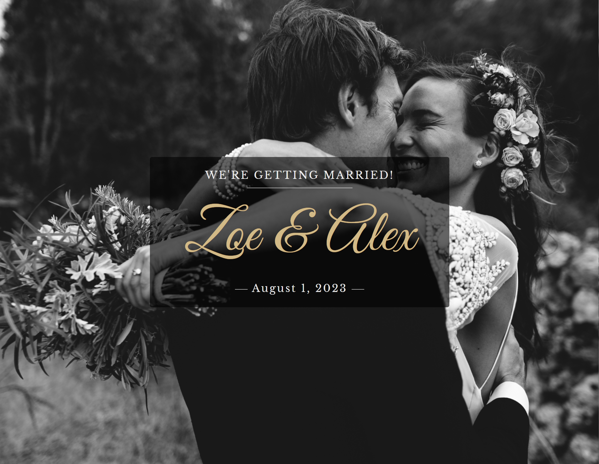

# Wedding website 💍
I created wedding site for Zoe and Alex as a school project. 🥰  
This is a simple website with the wedding's informations, like the Locations, Program list and FAQ section.

# Screenshot 🎢

# [Live demo](https://hrvtfnn.github.io/zoe-alex-wedding/) 🚀

# What I learned 🪄

I learned a lot about responsibility and how sections work during the project.   
It was challenging to work on responsibility and I had not worked with this many words before. I like how it turned out, but I have some plans to make it even better.🎉

# To Do List for the future

- [ ] Add navbar
- [ ] Toggle button navbar with icons on mobile 
- [ ] Smooth scroll
